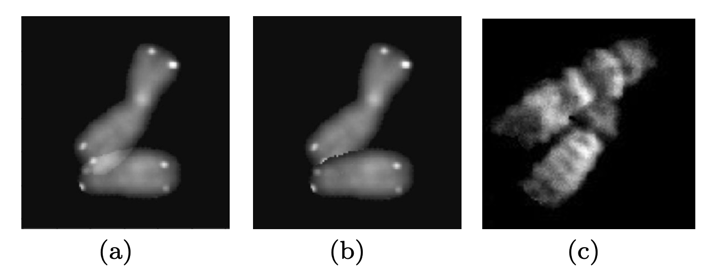

## README

This repository contains two datasets for the reproducible experiments of automatic segmentation of overlapping human chromosomes. 

### Datasets description

The Dataset 1 (new_train13434_light.zip) is used in recent works [[Ref1]](https://arxiv.org/pdf/1712.07639.pdf) and [[Ref2]](https://www.sciencedirect.com/science/article/pii/S1877050919313912). During overlapping chromosomes generation, the pixel-wise summation of greyscale values occurs (Figure-a), resulting in lighter overlapping regions which cannot be observed in real-world (Figure-c). The lighter overlapping regions are distinct for recognition and the non-overlapping regions of top and underlying chromosomes are indistinguishable. For generating more realistic overlapping chromosomes, the Dataset 2 (new_train13434.zip) is constructed by a modified method. Only the pixels of the top chromosomes remain, so the overlapping regions of the underlying chromosomes are opaque (Figure-b).

</a>

The main generation steps are identical to [[Ref1]](https://arxiv.org/pdf/1712.07639.pdf). Each dataset is composed of 13434 grayscale images (96 x 96 pixels). The only difference between Dataset 1 and Dataset 2 is the generation method of overlapping chromosomes. Due to the fixed random seed, the overlapping condition and image order are completely identical. 

More information of experiments and codes will be released and open-sourced when the camera-ready version is prepared.

### References

Ref1. [Image Segmentation to Distinguish Between Overlapping Human Chromosomes](https://arxiv.org/pdf/1712.07639.pdf)
Ref2. [Overlapping Chromosome Segmentation using U-Net: Convolutional Networks with Test Time Augmentation](https://www.sciencedirect.com/science/article/pii/S1877050919313912)